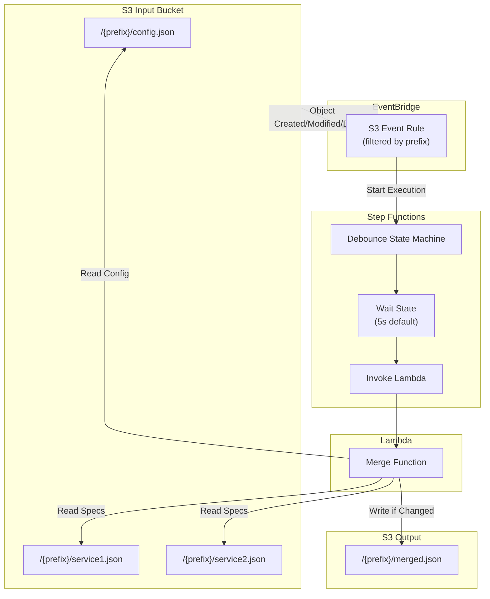
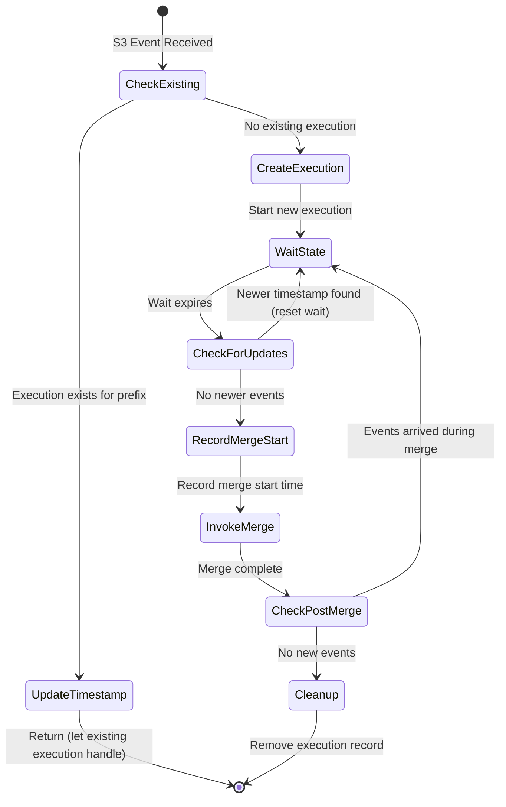

# Design Document: Lambda Merge Tool

## Overview

This design describes an AWS Lambda-based OpenAPI merge solution that automatically merges multiple OpenAPI specification files when changes are detected in S3. The architecture uses S3 event notifications, Step Functions for debouncing, and a CDK construct library for easy deployment.

The solution consists of three main components:
1. **Merge Lambda** - A Lambda function that performs the actual merge operation
2. **Debounce State Machine** - A Step Functions workflow that batches rapid changes
3. **CDK Construct** - A reusable infrastructure component for easy deployment



## Architecture

### Component Interaction Flow

1. **S3 Event** → User uploads/modifies a file in `{prefix}/`
2. **EventBridge Rule** → Filters events by prefix pattern, triggers Step Functions
3. **Debounce State Machine** → Waits for configurable duration, resets on new events
4. **Merge Lambda** → Loads config, discovers/loads sources, merges, compares, writes if changed

### Debounce Strategy

The debounce mechanism uses Step Functions with a DynamoDB table to track active executions per prefix. The key challenge is handling events that arrive *during* merge execution - we need to ensure those changes get merged too.

**Solution**: After the merge completes, we check if any new events arrived during execution. If so, we loop back and merge again.



**DynamoDB Record Structure**:
```json
{
  "prefix": "publicapi",           // Partition key
  "executionId": "exec-123",       // Current owner execution
  "lastEventTime": "2025-01-01T12:00:00Z",  // Last S3 event timestamp
  "mergeStartTime": "2025-01-01T12:00:05Z", // When merge started (null if waiting)
  "ttl": 1735689600                // Auto-cleanup after 5 minutes
}
```

**Race Condition Handling**:
1. When a new event arrives, it updates `lastEventTime`
2. Before invoking merge, we record `mergeStartTime`
3. After merge completes, we check if `lastEventTime > mergeStartTime`
4. If yes, new events arrived during merge → loop back to wait state
5. If no, we're done → cleanup and exit

This ensures no events are "lost" even if they arrive during merge execution.

### Project Structure

```
Oproto.Lambda.OpenApi.Merge.Lambda/
├── Functions/
│   └── MergeFunction.cs           # Lambda handler with Annotations
├── Services/
│   ├── IS3Service.cs              # S3 operations interface
│   ├── S3Service.cs               # S3 operations implementation
│   ├── IConfigLoader.cs           # Config loading interface
│   ├── ConfigLoader.cs            # Config loading implementation
│   ├── ISourceDiscovery.cs        # Source file discovery interface
│   └── SourceDiscovery.cs         # Source file discovery implementation
├── Models/
│   ├── LambdaMergeConfig.cs       # Extended config for Lambda
│   └── MergeResponse.cs           # Lambda response model
├── Oproto.Lambda.OpenApi.Merge.Lambda.csproj
└── serverless.template

Oproto.Lambda.OpenApi.Merge.Cdk/
├── OpenApiMergeConstruct.cs       # Main CDK construct
├── OpenApiMergeConstructProps.cs  # Construct properties
├── Oproto.Lambda.OpenApi.Merge.Cdk.csproj
└── cloudformation/
    └── openapi-merge.yaml         # Standalone CFN template
```

## Components and Interfaces

### Lambda Function

```csharp
namespace Oproto.Lambda.OpenApi.Merge.Lambda.Functions;

using Amazon.Lambda.Annotations;
using Amazon.Lambda.Core;
using Amazon.Lambda.S3Events;

public class MergeFunction
{
    private readonly IS3Service _s3Service;
    private readonly IConfigLoader _configLoader;
    private readonly ISourceDiscovery _sourceDiscovery;
    private readonly ILogger<MergeFunction> _logger;

    public MergeFunction(
        IS3Service s3Service,
        IConfigLoader configLoader,
        ISourceDiscovery sourceDiscovery,
        ILogger<MergeFunction> logger)
    {
        _s3Service = s3Service;
        _configLoader = configLoader;
        _sourceDiscovery = sourceDiscovery;
        _logger = logger;
    }

    [LambdaFunction]
    public async Task<MergeResponse> HandleMerge(
        MergeRequest request,
        ILambdaContext context)
    {
        // Implementation handles:
        // 1. Extract prefix from request
        // 2. Load config from {prefix}/config.json
        // 3. Discover or load explicit sources
        // 4. Perform merge using OpenApiMerger
        // 5. Compare with existing output
        // 6. Write if changed
        // 7. Return response with metrics
    }
}
```

### S3 Service Interface

```csharp
namespace Oproto.Lambda.OpenApi.Merge.Lambda.Services;

public interface IS3Service
{
    /// <summary>
    /// Reads a JSON file from S3 and deserializes it.
    /// </summary>
    Task<T?> ReadJsonAsync<T>(string bucket, string key, CancellationToken ct = default);
    
    /// <summary>
    /// Reads raw text content from S3.
    /// </summary>
    Task<string?> ReadTextAsync(string bucket, string key, CancellationToken ct = default);
    
    /// <summary>
    /// Writes JSON content to S3.
    /// </summary>
    Task WriteJsonAsync<T>(string bucket, string key, T content, CancellationToken ct = default);
    
    /// <summary>
    /// Lists objects with a given prefix.
    /// </summary>
    Task<IReadOnlyList<string>> ListObjectsAsync(string bucket, string prefix, CancellationToken ct = default);
    
    /// <summary>
    /// Checks if an object exists.
    /// </summary>
    Task<bool> ExistsAsync(string bucket, string key, CancellationToken ct = default);
}
```

### Config Loader Interface

```csharp
namespace Oproto.Lambda.OpenApi.Merge.Lambda.Services;

public interface IConfigLoader
{
    /// <summary>
    /// Loads and validates the merge configuration from S3.
    /// </summary>
    Task<LambdaMergeConfig> LoadConfigAsync(
        string bucket, 
        string prefix, 
        CancellationToken ct = default);
}
```

### Source Discovery Interface

```csharp
namespace Oproto.Lambda.OpenApi.Merge.Lambda.Services;

public interface ISourceDiscovery
{
    /// <summary>
    /// Discovers source files based on configuration.
    /// </summary>
    Task<IReadOnlyList<DiscoveredSource>> DiscoverSourcesAsync(
        string bucket,
        string prefix,
        LambdaMergeConfig config,
        CancellationToken ct = default);
}

public record DiscoveredSource(
    string Key,
    string Name,
    SourceConfiguration? ExplicitConfig);
```

### CDK Construct Interface

```csharp
namespace Oproto.Lambda.OpenApi.Merge.Cdk;

public class OpenApiMergeConstructProps
{
    /// <summary>
    /// The S3 bucket containing input files. Required.
    /// </summary>
    public required IBucket InputBucket { get; init; }
    
    /// <summary>
    /// The S3 bucket for output files. Defaults to InputBucket.
    /// </summary>
    public IBucket? OutputBucket { get; init; }
    
    /// <summary>
    /// List of API prefixes to monitor (e.g., "publicapi/", "internalapi/").
    /// </summary>
    public required IReadOnlyList<string> ApiPrefixes { get; init; }
    
    /// <summary>
    /// Debounce wait duration in seconds. Default: 5.
    /// </summary>
    public int DebounceSeconds { get; init; } = 5;
    
    /// <summary>
    /// Whether to create CloudWatch alarms. Default: true.
    /// </summary>
    public bool EnableAlarms { get; init; } = true;
    
    /// <summary>
    /// Failure count threshold for alarms. Default: 1.
    /// </summary>
    public int AlarmThreshold { get; init; } = 1;
    
    /// <summary>
    /// Number of evaluation periods for alarms. Default: 1.
    /// </summary>
    public int AlarmEvaluationPeriods { get; init; } = 1;
    
    /// <summary>
    /// Optional SNS topic for alarm notifications.
    /// </summary>
    public ITopic? AlarmTopic { get; init; }
    
    /// <summary>
    /// Lambda memory size in MB. Default: 512.
    /// </summary>
    public int MemorySize { get; init; } = 512;
    
    /// <summary>
    /// Lambda timeout in seconds. Default: 60.
    /// </summary>
    public int TimeoutSeconds { get; init; } = 60;
}
```

## Data Models

### Lambda Merge Configuration

The Lambda configuration extends the existing `MergeConfiguration` to maintain backwards compatibility. The new fields are also being added to the base `MergeConfiguration` class so they work with the CLI tool as well.

**Base MergeConfiguration Changes** (in Oproto.Lambda.OpenApi.Merge):

```csharp
namespace Oproto.Lambda.OpenApi.Merge;

public class MergeConfiguration
{
    // ... existing properties ...
    
    /// <summary>
    /// Whether to auto-discover source files in the directory.
    /// When true, ignores the sources list and discovers all .json files.
    /// Default: false (use explicit sources list).
    /// </summary>
    [JsonPropertyName("autoDiscover")]
    public bool AutoDiscover { get; set; } = false;
    
    /// <summary>
    /// Glob patterns for files to exclude from auto-discovery.
    /// Only used when autoDiscover is true.
    /// Always excludes the output file automatically.
    /// </summary>
    [JsonPropertyName("excludePatterns")]
    public List<string> ExcludePatterns { get; set; } = new();
}
```

**Lambda-Specific Extension** (in Oproto.Lambda.OpenApi.Merge.Lambda):

```csharp
namespace Oproto.Lambda.OpenApi.Merge.Lambda.Models;

public class LambdaMergeConfig : MergeConfiguration
{
    /// <summary>
    /// Output bucket name. If not specified, uses input bucket.
    /// Only applicable in Lambda context.
    /// </summary>
    [JsonPropertyName("outputBucket")]
    public string? OutputBucket { get; set; }
}
```

**Backwards Compatibility**:
- Existing configs without `autoDiscover` default to `false` (explicit sources)
- Existing configs without `excludePatterns` default to empty list
- All existing `MergeConfiguration` properties are preserved
- CLI tool gains `autoDiscover` and `excludePatterns` support automatically
```

### Merge Request/Response

```csharp
namespace Oproto.Lambda.OpenApi.Merge.Lambda.Models;

public record MergeRequest(
    string InputBucket,
    string Prefix,
    string? OutputBucket = null);

public record MergeResponse(
    bool Success,
    string Message,
    MergeMetrics Metrics,
    IReadOnlyList<string>? Warnings = null,
    string? Error = null);

public record MergeMetrics(
    int SourceFilesProcessed,
    int SchemasmergedCount,
    int PathsMergedCount,
    long DurationMs,
    bool OutputWritten,
    string? OutputKey = null);
```

### Example Config File

```json
{
  "info": {
    "title": "Public API",
    "version": "1.0.0",
    "description": "Merged public API specification"
  },
  "servers": [
    {
      "url": "https://api.example.com/v1",
      "description": "Production"
    }
  ],
  "autoDiscover": true,
  "excludePatterns": ["*-draft.json", "*.backup.json"],
  "output": "merged-openapi.json",
  "schemaConflict": "rename"
}
```

### Example Config with Explicit Sources

```json
{
  "info": {
    "title": "Internal API",
    "version": "2.0.0"
  },
  "autoDiscover": false,
  "sources": [
    {
      "path": "users-service.json",
      "name": "Users",
      "pathPrefix": "/users"
    },
    {
      "path": "orders-service.json", 
      "name": "Orders",
      "pathPrefix": "/orders"
    }
  ],
  "output": "internal-api.json",
  "schemaConflict": "rename"
}
```

## Step Functions State Machine (JSONata)

```json
{
  "Comment": "Debounce OpenAPI merge operations per API prefix with post-merge event checking",
  "QueryLanguage": "JSONata",
  "StartAt": "ExtractPrefix",
  "States": {
    "ExtractPrefix": {
      "Type": "Pass",
      "Output": {
        "prefix": "",
        "bucket": "",
        "eventTime": ""
      },
      "Next": "CheckExistingExecution"
    },
    "CheckExistingExecution": {
      "Type": "Task",
      "Resource": "arn:aws:states:::dynamodb:getItem",
      "Arguments": {
        "TableName": "${DebounceTable}",
        "Key": {
          "prefix": {"S": ""}
        }
      },
      "Output": {
        "prefix": "",
        "bucket": "",
        "eventTime": "",
        "exists": "",
        "existingExecutionId": ""
      },
      "Next": "BranchOnExisting"
    },
    "BranchOnExisting": {
      "Type": "Choice",
      "Choices": [
        {
          "Condition": "",
          "Next": "UpdateEventTimestamp"
        }
      ],
      "Default": "CreateExecution"
    },
    "UpdateEventTimestamp": {
      "Type": "Task",
      "Resource": "arn:aws:states:::dynamodb:updateItem",
      "Arguments": {
        "TableName": "${DebounceTable}",
        "Key": {
          "prefix": {"S": ""}
        },
        "UpdateExpression": "SET lastEventTime = :ts",
        "ExpressionAttributeValues": {
          ":ts": {"S": ""}
        }
      },
      "Comment": "Update timestamp and exit - existing execution will handle",
      "End": true
    },
    "CreateExecution": {
      "Type": "Task",
      "Resource": "arn:aws:states:::dynamodb:putItem",
      "Arguments": {
        "TableName": "${DebounceTable}",
        "Item": {
          "prefix": {"S": ""},
          "executionId": {"S": ""},
          "lastEventTime": {"S": ""},
          "ttl": {"N": ""}
        }
      },
      "Output": {
        "prefix": "",
        "bucket": ""
      },
      "Next": "WaitForDebounce"
    },
    "WaitForDebounce": {
      "Type": "Wait",
      "Seconds": "${DebounceSeconds}",
      "Next": "CheckForNewerEvents"
    },
    "CheckForNewerEvents": {
      "Type": "Task",
      "Resource": "arn:aws:states:::dynamodb:getItem",
      "Arguments": {
        "TableName": "${DebounceTable}",
        "Key": {
          "prefix": {"S": ""}
        }
      },
      "Output": {
        "prefix": "",
        "bucket": "",
        "isOwner": "",
        "lastEventTime": "",
        "mergeStartTime": ""
      },
      "Next": "BranchOnOwnership"
    },
    "BranchOnOwnership": {
      "Type": "Choice",
      "Choices": [
        {
          "Condition": "",
          "Next": "AbandonExecution"
        }
      ],
      "Default": "RecordMergeStart"
    },
    "AbandonExecution": {
      "Type": "Succeed",
      "Comment": "Another execution took over"
    },
    "RecordMergeStart": {
      "Type": "Task",
      "Resource": "arn:aws:states:::dynamodb:updateItem",
      "Arguments": {
        "TableName": "${DebounceTable}",
        "Key": {
          "prefix": {"S": ""}
        },
        "UpdateExpression": "SET mergeStartTime = :ts",
        "ExpressionAttributeValues": {
          ":ts": {"S": ""}
        }
      },
      "Output": {
        "prefix": "",
        "bucket": "",
        "mergeStartTime": ""
      },
      "Next": "InvokeMergeLambda"
    },
    "InvokeMergeLambda": {
      "Type": "Task",
      "Resource": "arn:aws:states:::lambda:invoke",
      "Arguments": {
        "FunctionName": "${MergeFunctionArn}",
        "Payload": {
          "inputBucket": "",
          "prefix": "",
          "outputBucket": "${OutputBucket}"
        }
      },
      "Output": {
        "prefix": "",
        "bucket": "",
        "mergeStartTime": "",
        "mergeResult": ""
      },
      "Next": "CheckPostMergeEvents",
      "Catch": [
        {
          "ErrorEquals": ["States.ALL"],
          "Next": "CheckPostMergeEvents",
          "Output": {
            "prefix": "",
            "bucket": "",
            "mergeStartTime": "",
            "mergeError": ""
          }
        }
      ]
    },
    "CheckPostMergeEvents": {
      "Type": "Task",
      "Resource": "arn:aws:states:::dynamodb:getItem",
      "Arguments": {
        "TableName": "${DebounceTable}",
        "Key": {
          "prefix": {"S": ""}
        }
      },
      "Output": {
        "prefix": "",
        "bucket": "",
        "mergeStartTime": "",
        "lastEventTime": "",
        "hasNewerEvents": ""
      },
      "Next": "BranchOnPostMergeEvents"
    },
    "BranchOnPostMergeEvents": {
      "Type": "Choice",
      "Choices": [
        {
          "Condition": "",
          "Next": "WaitForDebounce",
          "Comment": "Events arrived during merge - loop back"
        }
      ],
      "Default": "CleanupExecution"
    },
    "CleanupExecution": {
      "Type": "Task",
      "Resource": "arn:aws:states:::dynamodb:deleteItem",
      "Arguments": {
        "TableName": "${DebounceTable}",
        "Key": {
          "prefix": {"S": ""}
        }
      },
      "End": true
    }
  }
}
```


## Correctness Properties

*A property is a characteristic or behavior that should hold true across all valid executions of a system—essentially, a formal statement about what the system should do. Properties serve as the bridge between human-readable specifications and machine-verifiable correctness guarantees.*

### Property 1: Prefix Extraction Consistency

*For any* valid S3 key containing a prefix structure (e.g., `publicapi/config.json`, `internal/v2/service.json`), extracting the API prefix SHALL always return the directory path portion before the filename, and this extraction SHALL be deterministic (same input always produces same output).

**Validates: Requirements 1.1, 1.2, 1.3, 1.4**

### Property 2: Config Compatibility Round-Trip

*For any* valid `MergeConfiguration` object from the existing library, serializing it to JSON and deserializing it as `LambdaMergeConfig` SHALL preserve all original property values, and the `LambdaMergeConfig` SHALL have sensible defaults for Lambda-specific properties (`autoDiscover = false`).

**Validates: Requirements 2.3, 3.1**

### Property 3: Auto-Discovery Filtering

*For any* set of S3 keys within a prefix, when `autoDiscover` is true, the discovered sources SHALL include only `.json` files, SHALL exclude `config.json`, SHALL exclude the configured output file, and SHALL exclude files matching any `excludePatterns`.

**Validates: Requirements 3.2**

### Property 4: Explicit Sources Validation

*For any* `LambdaMergeConfig` where `autoDiscover` is false, the config SHALL be considered invalid if the `sources` array is null or empty.

**Validates: Requirements 3.3**

### Property 5: Output Comparison Normalization

*For any* two OpenAPI documents that are semantically equivalent (same paths, schemas, operations) but differ only in JSON formatting (whitespace, property order), the comparison function SHALL return true (equal).

**Validates: Requirements 5.2, 5.5**

### Property 6: Conditional Write Correctness

*For any* merge operation, if the new merged spec is semantically identical to the existing output spec, the write operation SHALL be skipped. If they differ, the write operation SHALL occur.

**Validates: Requirements 5.3, 5.4**

### Property 7: Output Path Construction

*For any* prefix and output filename configuration, the constructed output path SHALL be `{prefix}/{output}` for single-bucket mode, and the output key SHALL always be relative to the configured output bucket.

**Validates: Requirements 6.3, 6.5**

## Error Handling

### Configuration Errors

| Error Condition | Response | HTTP-equivalent |
|----------------|----------|-----------------|
| Config file not found | `MergeResponse` with `Success=false`, `Error="Configuration file not found at {path}"` | 404 |
| Invalid JSON in config | `MergeResponse` with `Success=false`, `Error="Invalid JSON: {details}"` | 400 |
| Missing required fields | `MergeResponse` with `Success=false`, `Error="Missing required field: {field}"` | 400 |
| Empty sources (autoDiscover=false) | `MergeResponse` with `Success=false`, `Error="No sources specified and autoDiscover is disabled"` | 400 |

### Source File Errors

| Error Condition | Response | Behavior |
|----------------|----------|----------|
| Source file not found | Warning logged, file skipped | Continue with remaining |
| Invalid OpenAPI spec | Warning logged, file skipped | Continue with remaining |
| All sources invalid | `MergeResponse` with `Success=false`, `Error="No valid source files found"` | Fail |

### Merge Errors

| Error Condition | Response |
|----------------|----------|
| Schema conflict (when strategy=Fail) | `MergeResponse` with `Success=false`, `Error="Schema conflict: {details}"` |
| Path conflict | `MergeResponse` with `Success=false`, `Error="Duplicate path: {path}"` |

### S3 Errors

| Error Condition | Response |
|----------------|----------|
| Access denied | `MergeResponse` with `Success=false`, `Error="Access denied to {bucket}/{key}"` |
| Bucket not found | `MergeResponse` with `Success=false`, `Error="Bucket not found: {bucket}"` |
| Write failure | `MergeResponse` with `Success=false`, `Error="Failed to write output: {details}"` |

## Testing Strategy

### Dual Testing Approach

This feature uses both unit tests and property-based tests:

- **Unit tests**: Verify specific examples, edge cases, and error conditions
- **Property tests**: Verify universal properties across all valid inputs using FsCheck

### Property-Based Testing Configuration

- **Library**: FsCheck with xUnit integration
- **Minimum iterations**: 100 per property test
- **Tag format**: `Feature: lambda-merge-tool, Property {number}: {property_text}`

### Test Categories

#### Unit Tests

1. **Prefix Extraction**
   - Extract prefix from `publicapi/config.json` → `publicapi`
   - Extract prefix from `internal/v2/service.json` → `internal/v2`
   - Handle root-level files (no prefix)

2. **Config Loading**
   - Load valid config with all fields
   - Load minimal config with defaults
   - Error on missing config file
   - Error on invalid JSON

3. **Source Discovery**
   - Auto-discover finds all JSON files
   - Auto-discover excludes config.json
   - Auto-discover excludes output file
   - Auto-discover applies exclude patterns
   - Explicit sources loads specified files

4. **Output Comparison**
   - Identical specs return equal
   - Different specs return not equal
   - Formatting differences ignored

5. **Error Handling**
   - Missing source file logged and skipped
   - Invalid OpenAPI logged and skipped
   - All sources invalid returns error

#### Property Tests

1. **PrefixExtractionProperty** - Property 1
   - Generate random valid S3 keys
   - Verify prefix extraction is deterministic
   - Verify extracted prefix + filename = original key

2. **ConfigCompatibilityProperty** - Property 2
   - Generate random MergeConfiguration objects
   - Serialize to JSON, deserialize as LambdaMergeConfig
   - Verify all original properties preserved

3. **AutoDiscoveryFilteringProperty** - Property 3
   - Generate random sets of S3 keys
   - Apply auto-discovery filtering
   - Verify only valid sources included

4. **ExplicitSourcesValidationProperty** - Property 4
   - Generate configs with autoDiscover=false
   - Verify validation fails when sources empty

5. **OutputComparisonNormalizationProperty** - Property 5
   - Generate random OpenAPI documents
   - Create formatting variations
   - Verify comparison returns equal

6. **ConditionalWriteProperty** - Property 6
   - Generate merge scenarios
   - Verify write occurs only when content differs

7. **OutputPathConstructionProperty** - Property 7
   - Generate random prefixes and output filenames
   - Verify path construction is correct

### Test File Structure

```
Oproto.Lambda.OpenApi.Merge.Lambda.Tests/
├── PrefixExtractionTests.cs
├── PrefixExtractionPropertyTests.cs
├── ConfigLoaderTests.cs
├── ConfigCompatibilityPropertyTests.cs
├── SourceDiscoveryTests.cs
├── AutoDiscoveryPropertyTests.cs
├── OutputComparisonTests.cs
├── OutputComparisonPropertyTests.cs
├── ConditionalWritePropertyTests.cs
├── OutputPathPropertyTests.cs
└── GlobalUsings.cs
```
